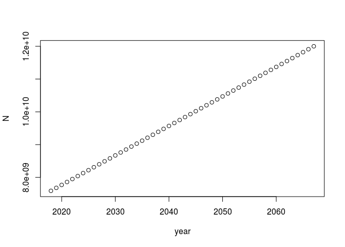
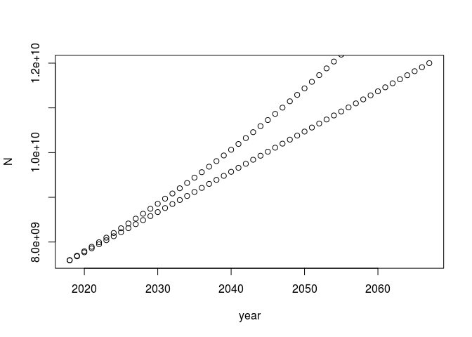

R basics
================
Jonas Schöley
September 5th, 2017

-   [Todays concepts](#todays-concepts)
-   [Todays operators](#todays-operators)
-   [Todays functions](#todays-functions)
-   [When will 10 billion people live on earth?](#when-will-10-billion-people-live-on-earth)
    -   [Arithmetic growth](#arithmetic-growth)
-   [Geometric growth](#geometric-growth)
-   [Exponential growth](#exponential-growth)
-   [Further reading](#further-reading)

Todays concepts
---------------

-   arithmetic calculations
-   order of evaluation
-   objects
-   assignments
-   the workspace
-   indexing
-   vectors
-   vectorization
-   data frames
-   functions
-   arguments
-   logical comparisons

Todays operators
----------------

-   `+`, `-`, `/`, `*`, `^`
-   `[]`
-   `<-`
-   `>=`
-   `:`

Todays functions
----------------

-   `data.frame()`
-   `plot()`, `lines()`
-   `log()`, `exp()`
-   `function()`
-   `uniroot()`

When will 10 billion people live on earth?
------------------------------------------

In 2017 around 7.5 billion live on planet earth. Ten years earlier the number was 6.6 billion. We feed this information into R by *assigning* it to an *object* via the *assignment operator* `<-`.

``` r
N2017 <- 7.5e9
N2007 <- 6.6e9
```

We choose the names `N2017` and `N2007` for our objects. It is a good idea to pick a name which lets you remember the content of the object. Some mild restrictions apply to naming:

> "A syntactically valid name consists of letters, numbers and the dot or underline characters and starts with a letter or the dot not followed by a number. Names such as '.2way' are not valid, and neither are the reserved words." (from `?make.names`)

### Arithmetic growth

Now that we know the world population at two points in time we can calculate the average absolute annual growth rate. Doing basic arithmetic in R feels much like using a desk calculator.

``` r
# an average annual growth of 90 million people
R <- (N2017-N2007)/10
```

Again, we assign the result of our calculation to a new object named `R`, the absolute annual growth rate.

We use absolute growth rates if we want to model linear growth, i.e. a situation where the population number *N* is a linear function of time:

*N*(*t* + *n*)=*N*(*t*)+*n**R*

So our projections for the population numbers in 2018 and 2019 are

``` r
N2017+R # 2018
```

    ## [1] 7.59e+09

``` r
N2017+R*2 # 2019
```

    ## [1] 7.68e+09

What about the next 10 years? It would be tedious to type it out manually so we make use of Rs vector arithmetic.

``` r
# next 10 years
N2017+R*1:10
```

    ##  [1] 7.59e+09 7.68e+09 7.77e+09 7.86e+09 7.95e+09 8.04e+09 8.13e+09
    ##  [8] 8.22e+09 8.31e+09 8.40e+09

Using the `:` operator we have constructed an integer sequence from 1 to 10, i.e. a vector object. Multiplying a *scalar* (a vector with a single element) like `R` with a vector like `1:10` produces a vector with entries *R* ⋅ 1, *R* ⋅ 2, …, *R* ⋅ 10. Vector (and matrix) operations are at the heart of R. Usually we don't need to state what we want on an element-by-element basis but instead work with complete vectors. Writing R code in a way that makes use of the vector and matrix features in R is called *vectorization* -- an important concept for writing efficient R code.

We want to get an estimate of when the world population will hit 10 million people. So we will linearly project 50 years into the future and store our results in a `data.frame` -- think of it as a table.

``` r
arith_growth <-
  data.frame(
    year = 2017 + 1:50,
    N = N2017 + R*1:50
  )
arith_growth
```

    ##    year         N
    ## 1  2018 7.590e+09
    ## 2  2019 7.680e+09
    ## 3  2020 7.770e+09
    ## 4  2021 7.860e+09
    ## 5  2022 7.950e+09
    ## 6  2023 8.040e+09
    ## 7  2024 8.130e+09
    ## 8  2025 8.220e+09
    ## 9  2026 8.310e+09
    ## 10 2027 8.400e+09
    ## 11 2028 8.490e+09
    ## 12 2029 8.580e+09
    ## 13 2030 8.670e+09
    ## 14 2031 8.760e+09
    ## 15 2032 8.850e+09
    ## 16 2033 8.940e+09
    ## 17 2034 9.030e+09
    ## 18 2035 9.120e+09
    ## 19 2036 9.210e+09
    ## 20 2037 9.300e+09
    ## 21 2038 9.390e+09
    ## 22 2039 9.480e+09
    ## 23 2040 9.570e+09
    ## 24 2041 9.660e+09
    ## 25 2042 9.750e+09
    ## 26 2043 9.840e+09
    ## 27 2044 9.930e+09
    ## 28 2045 1.002e+10
    ## 29 2046 1.011e+10
    ## 30 2047 1.020e+10
    ## 31 2048 1.029e+10
    ## 32 2049 1.038e+10
    ## 33 2050 1.047e+10
    ## 34 2051 1.056e+10
    ## 35 2052 1.065e+10
    ## 36 2053 1.074e+10
    ## 37 2054 1.083e+10
    ## 38 2055 1.092e+10
    ## 39 2056 1.101e+10
    ## 40 2057 1.110e+10
    ## 41 2058 1.119e+10
    ## 42 2059 1.128e+10
    ## 43 2060 1.137e+10
    ## 44 2061 1.146e+10
    ## 45 2062 1.155e+10
    ## 46 2063 1.164e+10
    ## 47 2064 1.173e+10
    ## 48 2065 1.182e+10
    ## 49 2066 1.191e+10
    ## 50 2067 1.200e+10

Our data frame has two columns and 50 rows. The columns have names `year` and `N`. The advantage of using a data frame to store your calculation results is the same advantage as using a table: all your results in a single place. Note that in order to "see" (`print` in R lingo) the table we have to explicitly call the object we stored the table in (`arith_growth`).

The function `plot()`, if applied to a data frame with two numeric columns, plots the first column against the second.

``` r
plot(arith_growth)
```



``` r
# all rows with a value of N larger or equal to 10 billion
arith_growth[arith_growth$N >= 10e9,]
```

    ##    year         N
    ## 28 2045 1.002e+10
    ## 29 2046 1.011e+10
    ## 30 2047 1.020e+10
    ## 31 2048 1.029e+10
    ## 32 2049 1.038e+10
    ## 33 2050 1.047e+10
    ## 34 2051 1.056e+10
    ## 35 2052 1.065e+10
    ## 36 2053 1.074e+10
    ## 37 2054 1.083e+10
    ## 38 2055 1.092e+10
    ## 39 2056 1.101e+10
    ## 40 2057 1.110e+10
    ## 41 2058 1.119e+10
    ## 42 2059 1.128e+10
    ## 43 2060 1.137e+10
    ## 44 2061 1.146e+10
    ## 45 2062 1.155e+10
    ## 46 2063 1.164e+10
    ## 47 2064 1.173e+10
    ## 48 2065 1.182e+10
    ## 49 2066 1.191e+10
    ## 50 2067 1.200e+10

``` r
# all years of rows with a value of N larger or equal to 10 billion
arith_growth[arith_growth$N >= 10e9, 'year'][1]
```

    ## [1] 2045

``` r
# the first year where N gets larger or equal to 10 billion
arith_growth[arith_growth$N >= 10e9, 'year'][1]
```

    ## [1] 2045

Geometric growth
----------------

*N*(*t* + *n*)=*N*(*t*)⋅(1 + *r*)<sup>*n*</sup>

``` r
# an average annual growth rate of ~1.3%
r <- (1+(N2017-N2007)/N2007)^(1/10) - 1

# next 10 years
N2007*(1+r)^(1:10) # what's with that: N0*(1+r)^1:10
```

    ##  [1] 6684911596 6770915612 6858026105 6946257308 7035623640 7126139705
    ##  [7] 7217820295 7310680391 7404735170 7500000000

``` r
geom_growth <-
  data.frame(
    year = 2017 + 1:100,
    N = N2017*(1+r)^(1:100)
  )
geom_growth
```

    ##     year           N
    ## 1   2018  7596490450
    ## 2   2019  7694222287
    ## 3   2020  7793211483
    ## 4   2021  7893474213
    ## 5   2022  7995026863
    ## 6   2023  8097886028
    ## 7   2024  8202068517
    ## 8   2025  8307591354
    ## 9   2026  8414471784
    ## 10  2027  8522727273
    ## 11  2028  8632375511
    ## 12  2029  8743434417
    ## 13  2030  8855922139
    ## 14  2031  8969857060
    ## 15  2032  9085257799
    ## 16  2033  9202143214
    ## 17  2034  9320532405
    ## 18  2035  9440444720
    ## 19  2036  9561899754
    ## 20  2037  9684917355
    ## 21  2038  9809517626
    ## 22  2039  9935720928
    ## 23  2040 10063547886
    ## 24  2041 10193019387
    ## 25  2042 10324156590
    ## 26  2043 10456980925
    ## 27  2044 10591514097
    ## 28  2045 10727778091
    ## 29  2046 10865795176
    ## 30  2047 11005587904
    ## 31  2048 11147179121
    ## 32  2049 11290591964
    ## 33  2050 11435849870
    ## 34  2051 11582976576
    ## 35  2052 11731996125
    ## 36  2053 11882932869
    ## 37  2054 12035811474
    ## 38  2055 12190656922
    ## 39  2056 12347494518
    ## 40  2057 12506349891
    ## 41  2058 12667249001
    ## 42  2059 12830218141
    ## 43  2060 12995283943
    ## 44  2061 13162473382
    ## 45  2062 13331813778
    ## 46  2063 13503332806
    ## 47  2064 13677058493
    ## 48  2065 13853019230
    ## 49  2066 14031243770
    ## 50  2067 14211761239
    ## 51  2068 14394601137
    ## 52  2069 14579793342
    ## 53  2070 14767368117
    ## 54  2071 14957356116
    ## 55  2072 15149788385
    ## 56  2073 15344696370
    ## 57  2074 15542111924
    ## 58  2075 15742067306
    ## 59  2076 15944595193
    ## 60  2077 16149728681
    ## 61  2078 16357501292
    ## 62  2079 16567946979
    ## 63  2080 16781100133
    ## 64  2081 16996995586
    ## 65  2082 17215668619
    ## 66  2083 17437154966
    ## 67  2084 17661490823
    ## 68  2085 17888712848
    ## 69  2086 18118858174
    ## 70  2087 18351964410
    ## 71  2088 18588069650
    ## 72  2089 18827212477
    ## 73  2090 19069431969
    ## 74  2091 19314767711
    ## 75  2092 19563259794
    ## 76  2093 19814948825
    ## 77  2094 20069875935
    ## 78  2095 20328082782
    ## 79  2096 20589611562
    ## 80  2097 20854505012
    ## 81  2098 21122806421
    ## 82  2099 21394559632
    ## 83  2100 21669809056
    ## 84  2101 21948599672
    ## 85  2102 22230977039
    ## 86  2103 22516987302
    ## 87  2104 22806677199
    ## 88  2105 23100094070
    ## 89  2106 23397285865
    ## 90  2107 23698301150
    ## 91  2108 24003189114
    ## 92  2109 24311999582
    ## 93  2110 24624783018
    ## 94  2111 24941590536
    ## 95  2112 25262473908
    ## 96  2113 25587485570
    ## 97  2114 25916678635
    ## 98  2115 26250106898
    ## 99  2116 26587824847
    ## 100 2117 26929887670

``` r
plot(arith_growth)
lines(geom_growth, type = 'p')
```



``` r
geom_growth[geom_growth$N >= 10e9, 'year'][1]
```

    ## [1] 2040

Exponential growth
------------------

*N*(*t* + *n*)=*N*(*t*)⋅exp(*r**n*)

``` r
r = log(N2017/N2007)/10

N2007*exp(r*1:10)
```

    ##  [1] 6684911596 6770915612 6858026105 6946257308 7035623640 7126139705
    ##  [7] 7217820295 7310680391 7404735170 7500000000

``` r
ExpGrowth <- function (x, N0, r) {
  N0*exp(r*x)
}

years_until_10b <- uniroot(function (x) {ExpGrowth(x, N2007, r)-10e9}, interval = c(0, 100))
years_until_10b
```

    ## $root
    ## [1] 32.50446
    ## 
    ## $f.root
    ## [1] -16.56351
    ## 
    ## $iter
    ## [1] 7
    ## 
    ## $init.it
    ## [1] NA
    ## 
    ## $estim.prec
    ## [1] 6.103516e-05

Further reading
---------------

-   Riffe etal. (2017). EDSD Computer Programming. Chapter 1. Basic R.
-   Smith, D. P., & Keyfitz, N. (2013). Mathematical Demography. Chapter 1.1. Berlin, Heidelberg: Springer. <https://doi.org/10.1007/978-3-642-35858-6>
