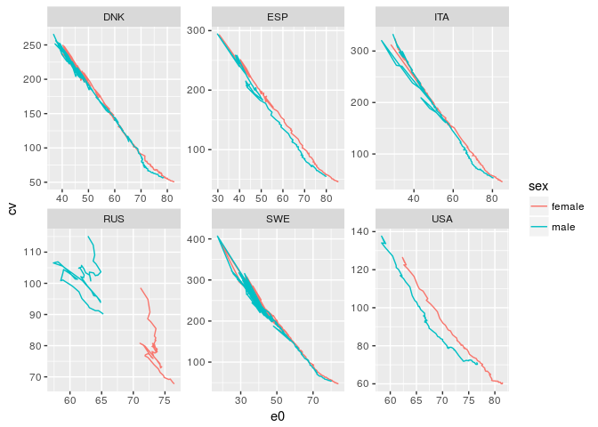
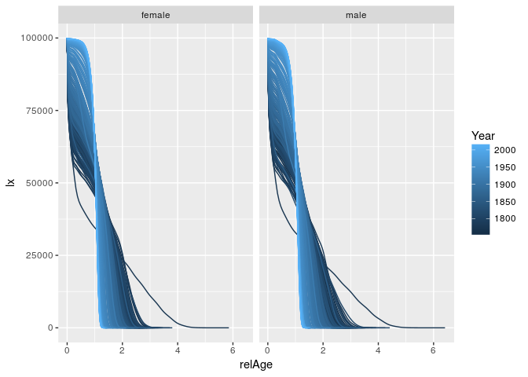

Data transformation
================
Jonas Schöley
September 18th, 2017

-   [Tidy data](#tidy-data)
-   [Data pipelines](#data-pipelines)
-   [Group wise operations](#group-wise-operations)
    -   [Group wise summary statistics](#group-wise-summary-statistics)
    -   [Group wise column operations](#group-wise-column-operations)

Tidy data
---------

``` r
library(tidyverse)
```

    ## Loading tidyverse: ggplot2
    ## Loading tidyverse: tibble
    ## Loading tidyverse: tidyr
    ## Loading tidyverse: readr
    ## Loading tidyverse: purrr
    ## Loading tidyverse: dplyr

    ## Conflicts with tidy packages ----------------------------------------------

    ## filter(): dplyr, stats
    ## lag():    dplyr, stats

Many programming tasks become easier once the data is in a tidy format. But what is tidy data? Our working definition: **data needs to be a data frame** and **every variable of interest needs to be a separate column**. Let's explore what that means.

``` r
head(WorldPhones)
```

    ##      N.Amer Europe Asia S.Amer Oceania Africa Mid.Amer
    ## 1951  45939  21574 2876   1815    1646     89      555
    ## 1956  60423  29990 4708   2568    2366   1411      733
    ## 1957  64721  32510 5230   2695    2526   1546      773
    ## 1958  68484  35218 6662   2845    2691   1663      836
    ## 1959  71799  37598 6856   3000    2868   1769      911
    ## 1960  76036  40341 8220   3145    3054   1905     1008

Here's the number of telephone connections over time by continent. The data is not *tidy* because its not a *data frame*, it's a matrix with row and column names. This gives us headaches if we want to use ggplot to plot the data.

``` r
ggplot(WorldPhones)
```

    ## Error: ggplot2 doesn't know how to deal with data of class matrix

We can easily fix this problem by converting the matrix to a data frame.

``` r
phones <- as.data.frame(WorldPhones)
```

Say we we want to plot the number of telephone connections over time by continent. This implies the following *variables of interest*:

    * the number of telephone connections `n`
    * the continent `cont`
    * the year `year`

Problem is, *none* of these variables are explicitly given in our data frame. Of course the data is all there, just not in a format we can use (with ggplot). So the question is how to reshape the data into a form where all the variables of interest are separate columns in the data frame.

To reshape we are going to use the libraries [dplyr](https://cran.rstudio.com/web/packages/dplyr/vignettes/introduction.html) and [tidyr](https://cran.r-project.org/web/packages/tidyr/vignettes/tidy-data.html). Both are loaded when you load `library(tidyverse)`.

The easiest variable to make explicit is the year. It is given as rownames of the data frame. We take the rownames, convert them from character to integer type, and add them as the variable `year` to the data frame. We use the `tidyverse` function `mutate()` to add a new variable to a data frame.

``` r
phones <- mutate(phones, year = as.integer(rownames(phones)))
phones
```

    ##   N.Amer Europe Asia S.Amer Oceania Africa Mid.Amer year
    ## 1  45939  21574 2876   1815    1646     89      555 1951
    ## 2  60423  29990 4708   2568    2366   1411      733 1956
    ## 3  64721  32510 5230   2695    2526   1546      773 1957
    ## 4  68484  35218 6662   2845    2691   1663      836 1958
    ## 5  71799  37598 6856   3000    2868   1769      911 1959
    ## 6  76036  40341 8220   3145    3054   1905     1008 1960
    ## 7  79831  43173 9053   3338    3224   2005     1076 1961

That leaves us with the variables *"number of telephone connections"* and *"continent"* to make explicit. They shall become separate columns in the data frame. With the help of `gather()` we **transform from wide to long format**.

``` r
phones <- gather(phones, key = cont, value = n, -year)
phones
```

    ##    year     cont     n
    ## 1  1951   N.Amer 45939
    ## 2  1956   N.Amer 60423
    ## 3  1957   N.Amer 64721
    ## 4  1958   N.Amer 68484
    ## 5  1959   N.Amer 71799
    ## 6  1960   N.Amer 76036
    ## 7  1961   N.Amer 79831
    ## 8  1951   Europe 21574
    ## 9  1956   Europe 29990
    ## 10 1957   Europe 32510
    ## 11 1958   Europe 35218
    ## 12 1959   Europe 37598
    ## 13 1960   Europe 40341
    ## 14 1961   Europe 43173
    ## 15 1951     Asia  2876
    ## 16 1956     Asia  4708
    ## 17 1957     Asia  5230
    ## 18 1958     Asia  6662
    ## 19 1959     Asia  6856
    ## 20 1960     Asia  8220
    ## 21 1961     Asia  9053
    ## 22 1951   S.Amer  1815
    ## 23 1956   S.Amer  2568
    ## 24 1957   S.Amer  2695
    ## 25 1958   S.Amer  2845
    ## 26 1959   S.Amer  3000
    ## 27 1960   S.Amer  3145
    ## 28 1961   S.Amer  3338
    ## 29 1951  Oceania  1646
    ## 30 1956  Oceania  2366
    ## 31 1957  Oceania  2526
    ## 32 1958  Oceania  2691
    ## 33 1959  Oceania  2868
    ## 34 1960  Oceania  3054
    ## 35 1961  Oceania  3224
    ## 36 1951   Africa    89
    ## 37 1956   Africa  1411
    ## 38 1957   Africa  1546
    ## 39 1958   Africa  1663
    ## 40 1959   Africa  1769
    ## 41 1960   Africa  1905
    ## 42 1961   Africa  2005
    ## 43 1951 Mid.Amer   555
    ## 44 1956 Mid.Amer   733
    ## 45 1957 Mid.Amer   773
    ## 46 1958 Mid.Amer   836
    ## 47 1959 Mid.Amer   911
    ## 48 1960 Mid.Amer  1008
    ## 49 1961 Mid.Amer  1076

What kind of black magic did just happen? **A short primer on wide versus long data format**:

Each table has a *wide format* and a long format representation. The information content is the same in both formats. It's the layout that differs.

Here's a wide format table containing the explicit variables `Female` and `Male`.

``` r
wide <- data_frame(group = c("a", "b"), Female = 1:2, Male = 3:4)
```

The same table in long format representation containing the explicit variables `Sex` and `N`.

``` r
long <- gather(wide, key = Sex, value = N, -group)
long
```

    ## # A tibble: 4 x 3
    ##   group    Sex     N
    ##   <chr>  <chr> <int>
    ## 1     a Female     1
    ## 2     b Female     2
    ## 3     a   Male     3
    ## 4     b   Male     4

If we want to go back to a wide format we can achieve that by using the function `spread()`.

``` r
spread(long, key = Sex, value = N)
```

    ## # A tibble: 2 x 3
    ##   group Female  Male
    ## * <chr>  <int> <int>
    ## 1     a      1     3
    ## 2     b      2     4

Back to our telephone example. We told the computer to look at all columns apart from `year` and transform them into the columns `cont` and `n`. `cont` holds the continent names for the variable `n`, the number of telephone connections. The continent names are taken from the original column names we *gathered* over. We now can plot our data easily.

``` r
ggplot(phones) +
  geom_line(aes(x = year, y = n, colour = cont))
```


Data pipelines
--------------

We can also write everything we did so far as a single *data analysis pipeline*. We start with the raw data and output a plot. This is a great approach for fast, interactive data analysis.

This is what we need to know in order to build pipelines:

-   The object on the left of the pipe operator (`%>%`) is passed onto the first argument of the function on the right
-   If we want to use the object on the left in other places than the first argument we can explicitly refer to it by using a dot (`.`)

Here's our telephone example in pipeline form.

``` r
# the raw data...
WorldPhones %>%
  # ...is converted to a data frame...
  as.data.frame() %>%
  # ...the rownames are added as the column `year`...
  # (note that I use the dot here to explicitly refer to the input data)
  mutate(year = as.integer(rownames(.))) %>%
  # ...the data gets transformed from wide to long format...
  gather(key = cont, value = n, -year) %>%
  # ...and finally plotted
  # (note that I can pipe the tidy data frame directly into ggplot)
  ggplot() +
  geom_line(aes(x = year, y = n, colour = cont))
```


Group wise operations
---------------------

A common data transformation task is to apply the same operation to different groups of the data set and to combine the results. This is easily achieved once the data is *tidy*.

### Group wise summary statistics

``` r
load('hmd_lt.RData')
head(hmd_lt)
```

    ## # A tibble: 6 x 13
    ## # Groups:   cntry [1]
    ##   cntry  Year   Age      mx      qx    ax     lx    dx    Lx      Tx    ex
    ##   <chr> <int> <int>   <dbl>   <dbl> <dbl>  <int> <int> <int>   <int> <dbl>
    ## 1   AUS  1921     0 0.05999 0.05731  0.22 100000  5731 95535 6318513 63.19
    ## 2   AUS  1921     1 0.01206 0.01199  0.50  94269  1130 93704 6222977 66.01
    ## 3   AUS  1921     2 0.00578 0.00576  0.50  93139   537 92870 6129274 65.81
    ## 4   AUS  1921     3 0.00289 0.00288  0.50  92602   267 92468 6036403 65.19
    ## 5   AUS  1921     4 0.00325 0.00325  0.50  92335   300 92185 5943935 64.37
    ## 6   AUS  1921     5 0.00252 0.00251  0.50  92035   231 91919 5851750 63.58
    ## # ... with 2 more variables: OpenInterval <lgl>, sex <chr>

Say we have a collection of life-tables by country, sex, and year and we want to calculate the coefficient of variation for the life-table distribution of deaths. In other words we want to

1.  group our data into subgroups defined by the values of country, sex and year (so a single sub-group may be Danish females in 2010)
2.  extract total life-expectancy from each sub-group life-table
3.  calculate the coefficient of variation for each sub-group
4.  Re-combine the results of 2 and 3 into a data frame with columns identifying the sub-groups

All of the above is achieved by the data pipeline below.

``` r
hmd_lt %>%
  group_by(cntry, sex, Year) %>%
  summarise(
    e0 = first(ex),
    cv = sqrt(sum(dx*(Age+ax-e0)^2)) / e0
  ) %>% ungroup()
```

    ## # A tibble: 6,916 x 5
    ##    cntry    sex  Year    e0       cv
    ##    <chr>  <chr> <int> <dbl>    <dbl>
    ##  1   AUS female  1921 63.19 129.1517
    ##  2   AUS female  1922 65.12 117.0454
    ##  3   AUS female  1923 63.67 122.7212
    ##  4   AUS female  1924 64.52 121.0953
    ##  5   AUS female  1925 65.39 117.0402
    ##  6   AUS female  1926 65.08 116.9264
    ##  7   AUS female  1927 64.86 118.4499
    ##  8   AUS female  1928 64.72 119.2820
    ##  9   AUS female  1929 65.39 115.0278
    ## 10   AUS female  1930 66.90 112.2689
    ## # ... with 6,906 more rows

We use the `group_by()` function to group our data into sub-groups, then we use the `summarise()` command to calculate the "summary statistics" for each sub-group. The `ungroup()` function in the end is optional but its good practive to ungroup after you're done with the group-wise operations.

Let's plot the results (for a subset of all countries):

``` r
hmd_lt %>%
  group_by(cntry, sex, Year) %>%
  summarise(
    e0 = first(ex),
    cv = sqrt(sum(dx*(Age+ax-e0)^2)) / e0
  ) %>% ungroup() %>%
  filter(cntry %in% c('SWE', 'RUS', 'ITA', 'DNK', 'USA', 'ESP')) %>%
  ggplot() +
  geom_path(aes(x = e0, y = cv, color = sex)) +
  facet_wrap(~cntry, scales = 'free')
```



### Group wise column operations

If, instead of summarising the data for each group in some form, we want to transform some columns in the data frame on a group-by-group basis we can use the `group_by()` together with `mutate()`.

Biologists sometimes express age not in years but in shares of total life-expectancy, i.e. the age of quarter life-expectancy, the age of half life-expectancy... Let's add this *relative* age to each life-table in the data. We need to

1.  group our data into sub-groups defined by the values of country, sex and year
2.  for each sub-group add a new column "relative age" to the life-table calculated as age over total life-expectancy
3.  Re-combine the results of 2 into a data frame with columns identifying the sub-groups

``` r
hmd_lt %>%
  group_by(cntry, sex, Year) %>%
  mutate(relAge = Age / ex[1])
```

    ## # A tibble: 767,676 x 14
    ## # Groups:   cntry, sex, Year [6,916]
    ##    cntry  Year   Age      mx      qx    ax     lx    dx    Lx      Tx
    ##    <chr> <int> <int>   <dbl>   <dbl> <dbl>  <int> <int> <int>   <int>
    ##  1   AUS  1921     0 0.05999 0.05731  0.22 100000  5731 95535 6318513
    ##  2   AUS  1921     1 0.01206 0.01199  0.50  94269  1130 93704 6222977
    ##  3   AUS  1921     2 0.00578 0.00576  0.50  93139   537 92870 6129274
    ##  4   AUS  1921     3 0.00289 0.00288  0.50  92602   267 92468 6036403
    ##  5   AUS  1921     4 0.00325 0.00325  0.50  92335   300 92185 5943935
    ##  6   AUS  1921     5 0.00252 0.00251  0.50  92035   231 91919 5851750
    ##  7   AUS  1921     6 0.00248 0.00248  0.50  91804   228 91690 5759831
    ##  8   AUS  1921     7 0.00181 0.00181  0.50  91576   166 91493 5668141
    ##  9   AUS  1921     8 0.00138 0.00138  0.50  91410   126 91347 5576648
    ## 10   AUS  1921     9 0.00137 0.00137  0.50  91283   125 91221 5485302
    ## # ... with 767,666 more rows, and 4 more variables: ex <dbl>,
    ## #   OpenInterval <lgl>, sex <chr>, relAge <dbl>

Let's plot the life-table survivor function over relative age by sex for Sweden across periods.

``` r
hmd_lt %>%
  group_by(cntry, sex, Year) %>%
  mutate(relAge = Age / ex[1]) %>%
  ungroup() %>%
  filter(cntry == 'SWE') %>%
  ggplot() +
  geom_line(aes(x = relAge, y = lx, group = Year, color = Year)) +
  facet_wrap(~sex)
```


