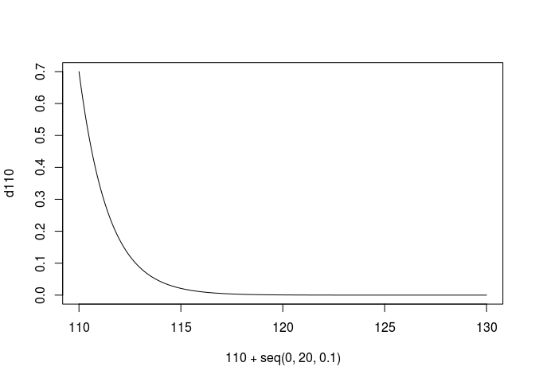
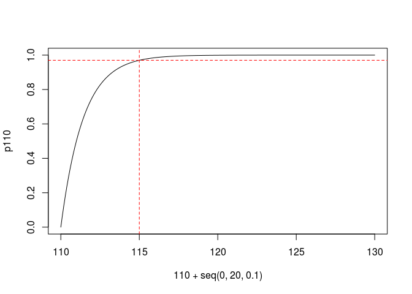
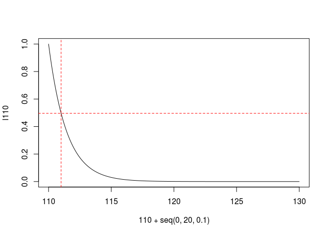
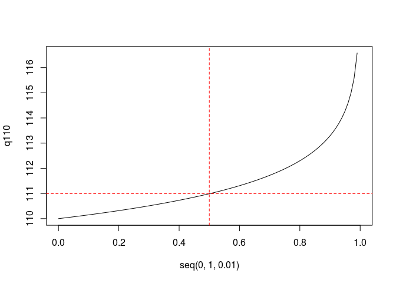
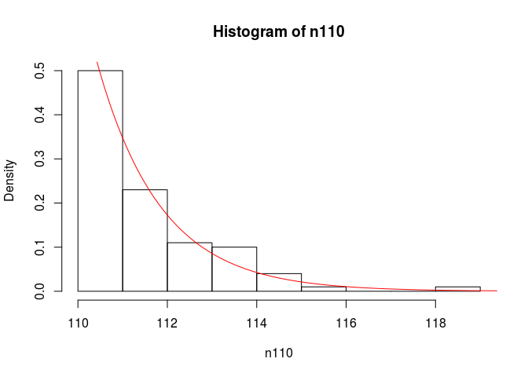
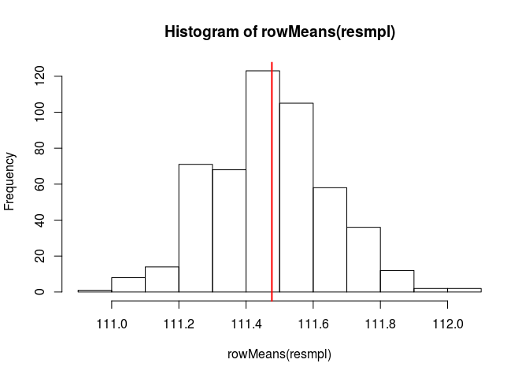
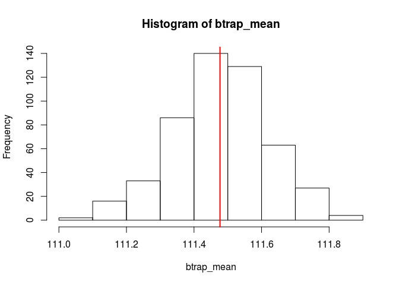
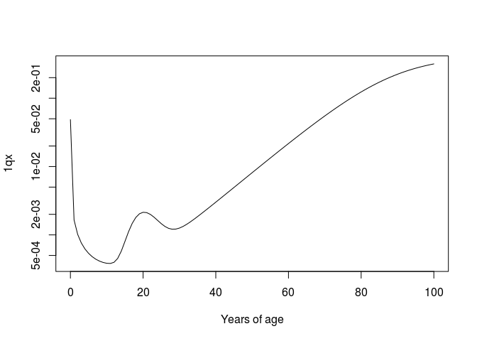

Probability distributions and Simulation
================
Jonas Schöley
September 21th, 2017

-   [Probability distributions](#probability-distributions)
-   [The central-limit theorem](#the-central-limit-theorem)
-   [The bootstrap](#the-bootstrap)
-   [Simulation of ages at death](#simulation-of-ages-at-death)

Probability distributions
-------------------------

Mortality after age 110 is flat with a death rate of 0.7 deaths per person-year lived (cp. Gampe, J. (2010) "Human mortality beyond age 110"). We can therefore model the distribution of deaths past age 110 with an exponential density with a rate paramenter of 0.7.

``` r
# The age distribution of deaths for those who survived until age 110.
d110 <- dexp(x = seq(0, 20, 0.1), rate = 0.7)
plot(x = 110 + seq(0, 20, 0.1), y = d110, type = 'l')
```



Of those who survived until age 110, what share has died until age 115?

``` r
p <- pexp(q = 5, rate = 0.7)
p
```

    ## [1] 0.9698026

``` r
p110 <- pexp(q = seq(0, 20, 0.1), rate = 0.7)
plot(x = 110 + seq(0, 20, 0.1), y = p110, type = 'l')
abline(h = p, v = 115, col = 'red', lty = 2)
```



Of those who survived until age 110, what share is still alive one year later?

``` r
l <- 1 - pexp(q = 1, rate = 0.7)
l
```

    ## [1] 0.4965853

``` r
l110 <- 1 - pexp(q = seq(0, 20, 0.1), rate = 0.7)
plot(x = 110 + seq(0, 20, 0.1), y = l110, type = 'l')
abline(h = l, v = 111, col = 'red', lty = 2)
```



Of those who survived until age 110, at what age will half of them have died?

``` r
q <- 110 + qexp(p = 0.5, rate = 0.7)
q
```

    ## [1] 110.9902

``` r
q110 <- 110 + qexp(p = seq(0, 1, 0.01), rate = 0.7)
plot(x = seq(0, 1, 0.01), y = q110, type = 'l')
abline(h = q, v = 0.5, col = 'red', lty = 2)
```



If 10,000 people reach age 110, what is the probability to observe a person reaching age 127?

``` r
10000 * (1 - pexp(q = 17, rate = 0.7))
```

    ## [1] 0.06790405

How many people must live to 110 for a 99 percent change of someone surviving to age 127?

``` r
0.99/(1 - pexp(q = 17, rate = 0.7))
```

    ## [1] 145794

What could a sample of 100 people who survived until age 110 look like in terms of their ages at death?

``` r
n110 <- 110 + rexp(n = 100, rate = 0.7)
head(n110)
```

    ## [1] 110.0225 111.3217 110.7725 113.3575 110.1801 115.3026

``` r
hist(n110, freq = FALSE)
lines(x = seq(110, 120, 0.1),
      y = dexp(x = seq(0, 10, 0.1), rate = 0.7),
      col = 'red')
```



The central-limit theorem
-------------------------

The average age at death for those who survive until age 110+:

``` r
n110_smpl_mean <- mean(n110)
n110_smpl_mean
```

    ## [1] 111.477

Let's say we have only observed a sub-sample of this population.

``` r
n110_smpl <- sample(n110, size = 40, replace = FALSE)
mean(n110_smpl)
```

    ## [1] 111.497

What is the sampling distribution around the mean of our sub-sample? The central limit theorem states that it is normal. To demonstrate this fact we will draw 500 additional samples from the full population and for each sample calculate the mean. The distribution of these sample averages should be approximately normal.

``` r
resmpl <- matrix(NA, nrow = 500, ncol = 40)
for (i in 1:500) {
  resmpl[i,] <- sample(n110, size = 40, replace = FALSE)
}
hist(rowMeans(resmpl))
abline(v = n110_smpl_mean, col = 'red', lwd = 2)
```



The bootstrap
-------------

What is the 95% confidence interval around the mean age of death of supercentenarians? We can use the bootstrap to answer this question.

``` r
# size of sample
n <- length(n110)
# number of bootstrap replications
k <- 500

# do the bootstrap
btrap <- matrix(NA, nrow = k, ncol = n)
for (i in 1:k) {
  btrap[i,] <- sample(n110, size = n, replace = TRUE)
}
```

We calculate the statistic of interest (in our case the mean) for each version of the bootstrapped samples.

``` r
btrap_mean <- apply(btrap, MARGIN = 1, FUN = mean)
```

The histogram of the distribution of the bootstrapped means shows the sampling distribution of the means.

``` r
hist(btrap_mean)
abline(v = mean(n110), col = 'red', lwd = 2)
```



We can then calculate statistics for the sampling distribution of the means such the standard deviation, which we will call the standard error of the estimate for the sample mean.

``` r
sd_btrap_mean <- sd(btrap_mean)
```

Having estimated the standard error of the sample mean we can construct confidence intervals.

``` r
mean(n110) - 1.96*sd_btrap_mean
```

    ## [1] 111.1974

``` r
mean(n110) + 1.96*sd_btrap_mean
```

    ## [1] 111.7566

Compare that to the confidence intervals as calculated from a t.test:

``` r
t.test(n110)
```

    ## 
    ##  One Sample t-test
    ## 
    ## data:  n110
    ## t = 761.99, df = 99, p-value < 2.2e-16
    ## alternative hypothesis: true mean is not equal to 0
    ## 95 percent confidence interval:
    ##  111.1867 111.7673
    ## sample estimates:
    ## mean of x 
    ##   111.477

The advantage of the bootstrap is that it provides us with an estimate for the standard error of all kinds of statistics. Next, we bootstrap 95 % confidence intervals for the coefficient of variation of the ages at death for supercentenarians.

``` r
CV <- function (x) {
  sd(x)/ mean(x)
}

btrap_cv <- apply(btrap, MARGIN = 1, FUN = CV)
sd_btrap_cv <- sd(btrap_cv)
CV(n110) - 1.96*sd_btrap_cv
```

    ## [1] 0.01025024

``` r
CV(n110) + 1.96*sd_btrap_cv
```

    ## [1] 0.01599683

Simulation of ages at death
---------------------------

``` r
# Heligman-Pollard mortality model
HP <- function (x, A, B, C, D, E, f, G, H, K) {
  qx = A^((x+B)^C) + D*exp(-E*(log(x)-log(f))^2) + (G*H^x)/(1+K*G*H^x)
  return(qx)
}

# parameters which predict single year qx for a modern human population
A = 0.0016; B = 0.00112; C = 0.1112
D = 0.00163; E = 16.71; f = 20.03
G = 0.0000502; H = 1.1074; K = 2.41

curve(HP(x, A, B, C,
         D, E, f,
         G, H, K),
      from = 0, to = 100, log = "y", xlab = "Years of age", ylab = "1qx")
```



``` r
lx = 1e5 # cohort size at birth
i = 0 # starting age

# simulate cohort ages at death following HP qx pattern
# end simulation when everyone is dead
age_at_death = NULL; while (lx > 0) {
  qx = HP(i, A, B, C, D, E, f, G, H, K)
  
  # determine if subject dies during [x, x+w)
  survival_indicator = rbinom(n = lx, size = 1, prob = qx)
  # number of deaths during [x, x+w)
  dx = sum(survival_indicator)
  
  # add ages at death of those who died to existing records
  age_at_death = c(age_at_death, rep(i, dx))
  
  # update number of survivors to x+w
  lx = lx-dx
  # update current age
  i=i+1
}

head(age_at_death)
```

    ## [1] 0 0 0 0 0 0

``` r
hist(age_at_death, breaks = 0:120, probability = TRUE)
```


