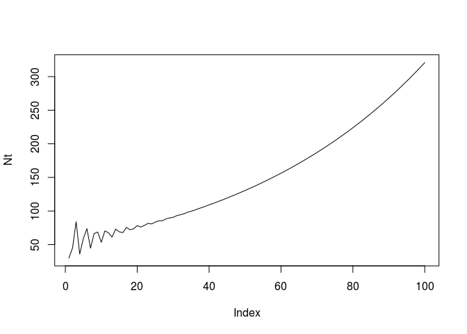
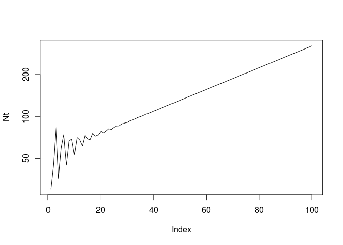

Matrix algebra
================
Jonas Schöley
September 22th, 2017

-   [Basic matrix function and operations](#basic-matrix-function-and-operations)
-   [Population projections using the Leslie-Matrix](#population-projections-using-the-leslie-matrix)
-   [Projecting an animal population](#projecting-an-animal-population)

Basic matrix function and operations
------------------------------------

Creating a matrix:

``` r
matrix(1:9, nrow = 3)
```

    ##      [,1] [,2] [,3]
    ## [1,]    1    4    7
    ## [2,]    2    5    8
    ## [3,]    3    6    9

``` r
cbind(1:3, 4:6, 7:9)
```

    ##      [,1] [,2] [,3]
    ## [1,]    1    4    7
    ## [2,]    2    5    8
    ## [3,]    3    6    9

``` r
matrix(1:9, nrow = 3, byrow = TRUE)
```

    ##      [,1] [,2] [,3]
    ## [1,]    1    2    3
    ## [2,]    4    5    6
    ## [3,]    7    8    9

``` r
rbind(1:3, 4:6, 7:9)
```

    ##      [,1] [,2] [,3]
    ## [1,]    1    2    3
    ## [2,]    4    5    6
    ## [3,]    7    8    9

``` r
diag(3)
```

    ##      [,1] [,2] [,3]
    ## [1,]    1    0    0
    ## [2,]    0    1    0
    ## [3,]    0    0    1

Element-by-element arithmetic of a matrix with a scalar:

``` r
M <- matrix(1, nrow = 3, ncol = 3)
M
```

    ##      [,1] [,2] [,3]
    ## [1,]    1    1    1
    ## [2,]    1    1    1
    ## [3,]    1    1    1

``` r
M*3
```

    ##      [,1] [,2] [,3]
    ## [1,]    3    3    3
    ## [2,]    3    3    3
    ## [3,]    3    3    3

``` r
M+3
```

    ##      [,1] [,2] [,3]
    ## [1,]    4    4    4
    ## [2,]    4    4    4
    ## [3,]    4    4    4

Element-by-element arithmetic of a matrix with a vector:

``` r
M*1:3
```

    ##      [,1] [,2] [,3]
    ## [1,]    1    1    1
    ## [2,]    2    2    2
    ## [3,]    3    3    3

``` r
#M*1:2 # carefull
```

Transposing a vector:

``` r
v <- 1:9 # a column vector
v
```

    ## [1] 1 2 3 4 5 6 7 8 9

``` r
t(v) # a row vector (a matrix with a single row)
```

    ##      [,1] [,2] [,3] [,4] [,5] [,6] [,7] [,8] [,9]
    ## [1,]    1    2    3    4    5    6    7    8    9

Transposing a matrix:

``` r
M2 <- matrix(1:9, nrow = 3)
M2
```

    ##      [,1] [,2] [,3]
    ## [1,]    1    4    7
    ## [2,]    2    5    8
    ## [3,]    3    6    9

``` r
t(M2)
```

    ##      [,1] [,2] [,3]
    ## [1,]    1    2    3
    ## [2,]    4    5    6
    ## [3,]    7    8    9

Matrix multiplication of a matrix with a vector:

``` r
M %*% 1:3
```

    ##      [,1]
    ## [1,]    6
    ## [2,]    6
    ## [3,]    6

``` r
#M %*% t(1:3) # carefull (n*m <> m*k)
```

Matrix multiplication of a matrix with a matrix:

``` r
set.seed('1987') # for reproducibility
M3 <- matrix(sample(0:3, size = 9, replace = TRUE), nrow = 3)
M4 <- matrix(sample(0:1, size = 9, replace = TRUE), nrow = 3)
M3 %*% M4
```

    ##      [,1] [,2] [,3]
    ## [1,]    2    0    1
    ## [2,]    3    3    0
    ## [3,]    5    2    2

``` r
M4 %*% M3
```

    ##      [,1] [,2] [,3]
    ## [1,]    3    3    0
    ## [2,]    0    1    1
    ## [3,]    2    4    3

``` r
M4 %*% diag(3)
```

    ##      [,1] [,2] [,3]
    ## [1,]    0    1    0
    ## [2,]    1    0    0
    ## [3,]    1    0    1

Matrix inverse

``` r
solve(M3)
```

    ##      [,1]       [,2] [,3]
    ## [1,]   -2 -0.3333333    1
    ## [2,]    2  0.6666667   -1
    ## [3,]   -1 -0.6666667    1

``` r
solve(M3)%*%M3
```

    ##      [,1] [,2] [,3]
    ## [1,]    1    0    0
    ## [2,]    0    1    0
    ## [3,]    0    0    1

Solving a system of linear equations:

``` r
B <-
  rbind(
    c(25, 3, 9),
    c(9, 10, 5),
    c(14, 35, 4)
  )
Y <- c(13, 11, 11)
X <- solve(B, Y)
B%*%X
```

    ##      [,1]
    ## [1,]   13
    ## [2,]   11
    ## [3,]   11

Population projections using the Leslie-Matrix
----------------------------------------------

``` r
# the Leslie matrix (population projection matrix)
A <- rbind(
  c(0, 1, 5),
  c(0.3, 0, 0),
  c(0, 0.5, 0)
)

# the initial population distribution
N0 <- c(100, 0, 0)

# population after single time step
N1 <- A%*%N0; N1
```

    ##      [,1]
    ## [1,]    0
    ## [2,]   30
    ## [3,]    0

``` r
# population after 2 time steps
N2 <- A%*%N1; N2
```

    ##      [,1]
    ## [1,]   30
    ## [2,]    0
    ## [3,]   15

``` r
# population after 3 time steps
N3 <- A%*%N2; N3
```

    ##      [,1]
    ## [1,]   75
    ## [2,]    9
    ## [3,]    0

``` r
# a package for matrix exponentiation
# install.packages('expm')
library(expm)
```

    ## Loading required package: Matrix

    ## 
    ## Attaching package: 'expm'

    ## The following object is masked from 'package:Matrix':
    ## 
    ##     expm

``` r
A%^%3 %*% N0 # same as N3
```

    ##      [,1]
    ## [1,]   75
    ## [2,]    9
    ## [3,]    0

``` r
# population structure in the distant future
A%^%100 %*% N0
```

    ##           [,1]
    ## [1,] 222.90637
    ## [2,]  65.67980
    ## [3,]  32.25447

``` r
# projecting total population size 100 time
# steps into the future
Nt <- rep(NA, times = 100)
for (t in 1:100) {
  Nt[t] <- sum(A%^%t %*% N0)
}
plot(Nt, type = 'l')
```



``` r
plot(Nt, type = 'l', log = 'y')
```



``` r
# intrinsic growth rate
r <- Re(eigen(A)$values[1])
r
```

    ## [1] 1.01815

``` r
log(r)
```

    ## [1] 0.01798752

``` r
# log(Nt) ~ a + bt
# Nt ~ exp(a + bt)
# Nt ~ exp(a) * exp(bt)
time <- 1:100
lm(log(Nt)~time)
```

    ## 
    ## Call:
    ## lm(formula = log(Nt) ~ time)
    ## 
    ## Coefficients:
    ## (Intercept)         time  
    ##     3.93898      0.01848

Projecting an animal population
-------------------------------

``` r
load('COMADRE_v.2.0.1.RData')

# population matrix for Australian females 1980-1985
A_aus <- comadre$mat[[777]][['matA']]

# class (age) labels for matrix 777
age_lab <- comadre$matrixClass[[777]][[2]]

# stable population distribution
p_stable_aus <- prop.table(Re(eigen(A_aus)$vectors[,1]))
# intrinsic growth rate
r_aus <- Re(eigen(A_aus)$values[1])
r_aus
```

    ## [1] 0.9852688

``` r
data.frame(x = age_lab, p = p_stable_aus)
```

    ##              x          p
    ## 1    0-4 years 0.08546166
    ## 2    5-9 years 0.08660499
    ## 3  10-14 years 0.08782515
    ## 4  15-19 years 0.08901258
    ## 5  20-24 years 0.09012392
    ## 6  25-29 years 0.09122718
    ## 7  30-34 years 0.09233839
    ## 8  35-39 years 0.09339659
    ## 9  40-44 years 0.09430862
    ## 10 45-49 years 0.09486869
    ## 11 50-54 years 0.09483222
    ## 12   55+ years 0.00000000
